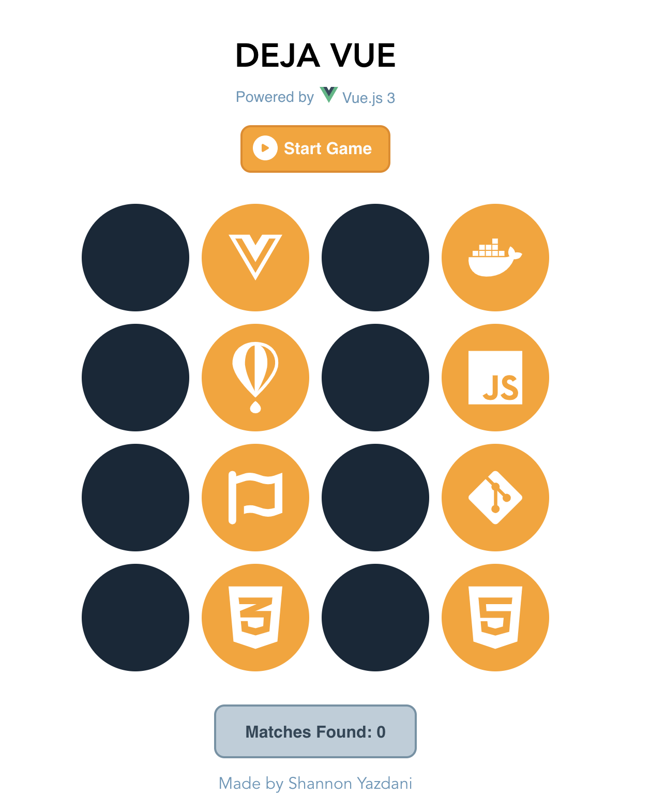

# :star: Deja Vue

This is a memory game built in vue, using React Icons for the images of the tech stacks used for this project.

### :camera: Screenshots
<div align="center">

</div>

## :hammer: Project setup
```
npm install
```

### Compiles and hot-reloads for development
```
npm run serve
```

### Compiles and minifies for production
```
npm run build
```
